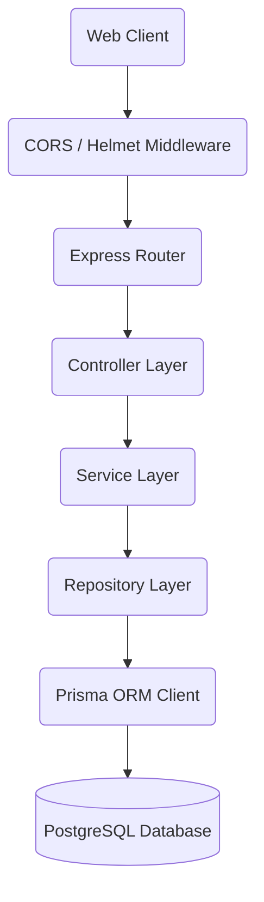

# Architecture Specification

This document provides a technical overview of the TransitOps Enterprise Fleet Operations ERP architecture.

## 🏗 System Overview

TransitOps uses a monorepo architecture separating the Next.js frontend, Express API backend, and shared libraries.

---

## 🎨 Design Principles & Patterns

### 1. Monorepo Organization

- Shared models and configurations reside inside `packages/` to ensure full sync between backend modules and the web frontend.
- Isolated applications in `apps/` maintain clean deployment boundaries.

### 2. Separation of Concerns (Controller-Service-Repository)

To support clean testability and modular replacements:

- **Router**: Defines HTTP paths, parameters, and registers path validations.
- **Controller**: Processes HTTP request parameters, sets headers/cookies, and sends standard responses. Contains **no business logic**.
- **Service**: Implements business operations, checks permissions, handles transaction logic, and processes logs.
- **Repository**: Directly executes database operations (using Prisma Client) and structures database filters.
- **Database**: PostgreSQL data persistence.

### 3. Centralized Authentication

- **Access Tokens**: Short-lived JWTs (e.g., 15 minutes) passed in the `Authorization` header.
- **Refresh Tokens**: Long-lived JWTs (e.g., 7 days) stored in HttpOnly, secure, SameSite cookies.
- **Role & Permission Verification**: Handled by centralized middleware, decoding token payload properties.

### 4. Logging & Auditing

- **morgan**: Formats HTTP request details and streams them to the application logger.
- **winston**: Separates error, request, security, and data audit trails into distinct daily rolling files.
