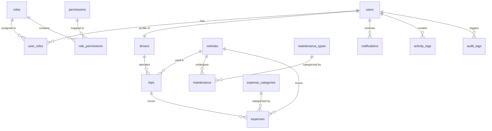

# Database Schema Design

TransitOps uses **PostgreSQL** configured via **Prisma ORM**. All tables use UUID keys and standard audit properties.

## 🛠 Database Schema Conventions
- **Naming:** Lowercase snake_case table names (`users`, `user_roles`, `fuel_logs`).
- **Keys:** Every primary key is a UUIDv4 (`id`).
- **Soft Delete:** A `deleted_at` timestamp field indicates logical deletion. Queries should always filter by `deleted_at: null` unless history is required.
- **Audit Columns:**
  - `created_at` (timestamp with time zone, defaults to current time)
  - `updated_at` (automatic modification timestamp)
  - `created_by` (optional user UUID)
  - `updated_by` (optional user UUID)

---

## 🗃 Entity Relationships

---

## 📋 Table Indexing Strategy

To maintain high performance as data scales, the following indexes are generated:
- `users(email)`
- `roles(code)`
- `permissions(code)`
- `vehicles(plate_number)`
- `trips(vehicle_id, driver_id, status)`
- `maintenance(vehicle_id, status)`
- `fuel_logs(vehicle_id)`
- `expenses(expense_category_id)`
- `notifications(user_id, is_read)`
- `activity_logs(user_id)`
- `audit_logs(entity_name, entity_id)`

Additionally, a composite unique index is set on mapping tables `user_roles(user_id, role_id)` and `role_permissions(role_id, permission_id)`.
